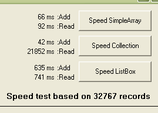



## Simple Array Class

### Description

An easy way to add, read, remove, and find items in a single dimensioned array (emulates VB&#8217;s ListBox functionality without the user interface). Don&#8217;t use a ListBox or a Collection to build an array just because they have built in functions that make them easier to use; both these choices are slow, require a lot of overhead and were designed to meet a specific need. (UPDATED: Added Property Get Text).
 
### More Info
 

             |
---                |---
**Submitted On**   |2006-10-17 09:11:26
**By**             |[Morgan Haueisen](https://github.com/Planet-Source-Code/PSCIndex/blob/master/ByAuthor/morgan-haueisen.md)
**Level**          |Intermediate
**User Rating**    |4.8 (48 globes from 10 users)
**Compatibility**  |VB 6\.0
**Category**       |[Miscellaneous](https://github.com/Planet-Source-Code/PSCIndex/blob/master/ByCategory/miscellaneous__1-1.md)
**World**          |[Visual Basic](https://github.com/Planet-Source-Code/PSCIndex/blob/master/ByWorld/visual-basic.md)
**Archive File**   |[Simple\_Arr20254310172006\.zip](https://github.com/Planet-Source-Code/morgan-haueisen-simple-array-class__1-66714/archive/master.zip)

